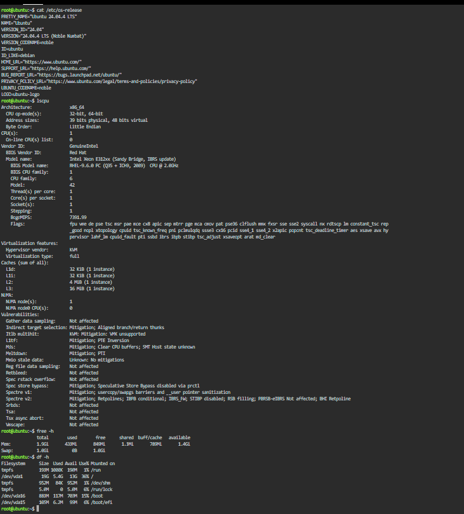

# Checkpoint 7 – Continue Your Linux Investigation

## KillerCoda Playground

A KillerCoda Playground was used to inspect the Linux server using basic Linux commands.

## Operating System

```bash
cat /etc/os-release
```

Ubuntu 24.04.2 LTS

## CPU Information

```bash
lscpu
```

Intel Xeon E312x (Sandy Bridge), 1 CPU, approximately 2.0 GHz

## Memory

```bash
free -h
```

1.96 GiB

## Disk Space

```bash
df -h
```

19 GB

## Cloud Migration

If this Linux server were migrated to the cloud, the following services could host it:

### AWS

**Amazon EC2** – a virtual machine service that can run a Linux server.

### Azure

**Azure Virtual Machines** – a virtual machine service that supports Linux servers.

### GCP

**Compute Engine** – a virtual machine service that can be used to run a Linux server.

## Terminal Output

The screenshot below shows the terminal output from the Linux commands used to identify the operating system, CPU information, memory, and disk space.


