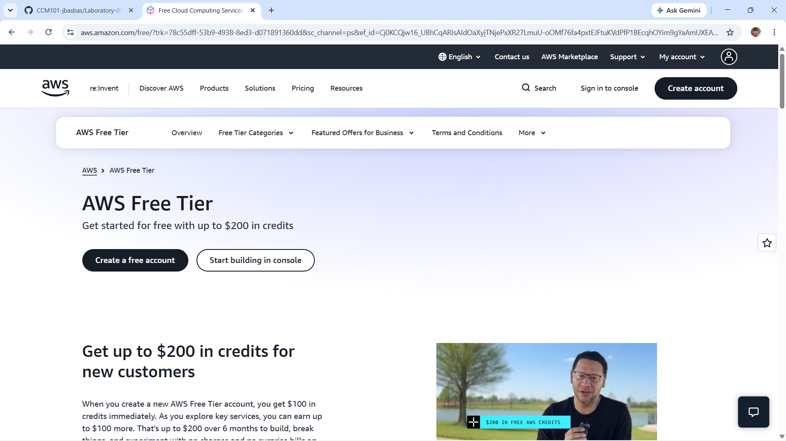

# AWS Research

## Brief Overview

Amazon Web Services (AWS) is a cloud platform provided by Amazon. It offers different services for running applications, storing information, managing databases, creating networks, and handling computing resources.

## Global Infrastructure

AWS uses Regions and Availability Zones in different parts of the world. Regions represent geographic areas, while Availability Zones are separate locations inside a Region. This setup helps organizations choose where to deploy their resources and improve availability.

## Cloud Management Console

The AWS Management Console is a web-based interface where users can create, configure, monitor, and manage AWS resources.

## Four Core Services

### 1. Amazon EC2

Amazon EC2 provides virtual servers that can be used to run applications and other workloads.

### 2. Amazon S3

Amazon S3 is an object storage service used for storing files, backups, and other data.

### 3. Amazon VPC

Amazon VPC allows users to create and manage a virtual network for AWS resources.

### 4. AWS IAM

AWS IAM manages users, roles, and permissions. It controls who can access AWS resources and what they are allowed to do.

## Three Advantages

1. AWS has a large number of cloud services.
2. It has infrastructure in many locations around the world.
3. AWS resources can be adjusted depending on the workload.

## Typical Enterprise Use Cases

AWS can be used for websites, mobile applications, e-commerce systems, databases, backups, and other business applications.

## Screenshot

AWS screenshot:

