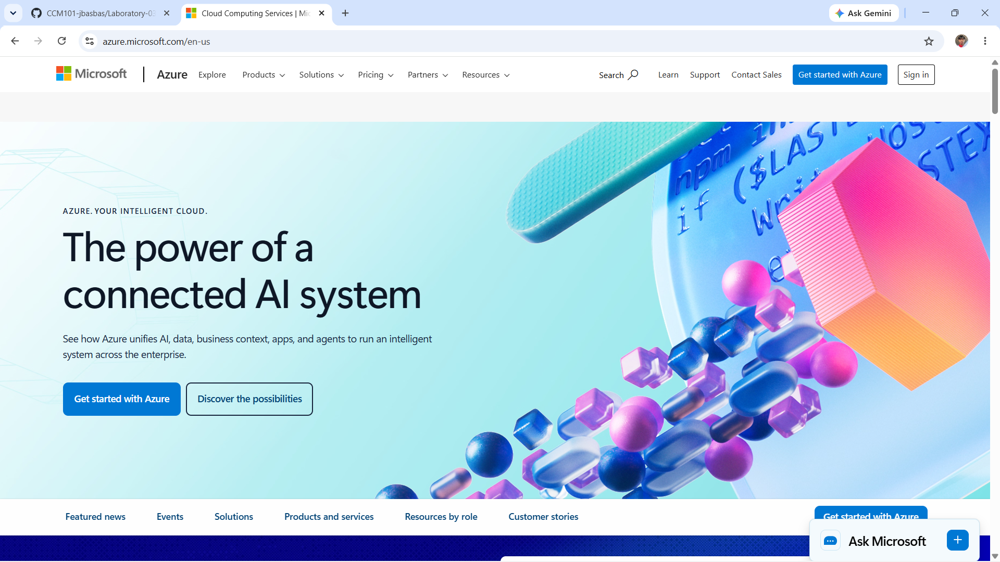

# Microsoft Azure Research

## Brief Overview

Microsoft Azure is Microsoft's cloud computing platform. It provides services for virtual machines, storage, networking, databases, identity, security, and business applications.

## Global Infrastructure

Azure has Regions and Availability Zones in different parts of the world. Organizations can select a suitable location for their applications and resources.

## Cloud Management Console

Azure Portal is the web-based interface used to create, configure, monitor, and manage Azure resources.

## Four Core Services

### 1. Azure Virtual Machines

Azure Virtual Machines provide virtual computers that can run Windows or Linux operating systems.

### 2. Azure Blob Storage

Azure Blob Storage is used to store files and other types of unstructured data.

### 3. Azure Virtual Network

Azure Virtual Network provides networking for Azure resources and allows organizations to control communication between them.

### 4. Microsoft Entra ID

Microsoft Entra ID is used to manage identities and control access to resources.

## Three Advantages

1. Azure works well with Microsoft technologies.
2. It is useful for organizations with existing Microsoft systems.
3. It supports cloud and hybrid-cloud environments.

## Typical Enterprise Use Cases

Azure can be used for Windows Server systems, enterprise applications, databases, Microsoft-based environments, and hybrid cloud systems.

## Screenshot

Azure screenshot:

