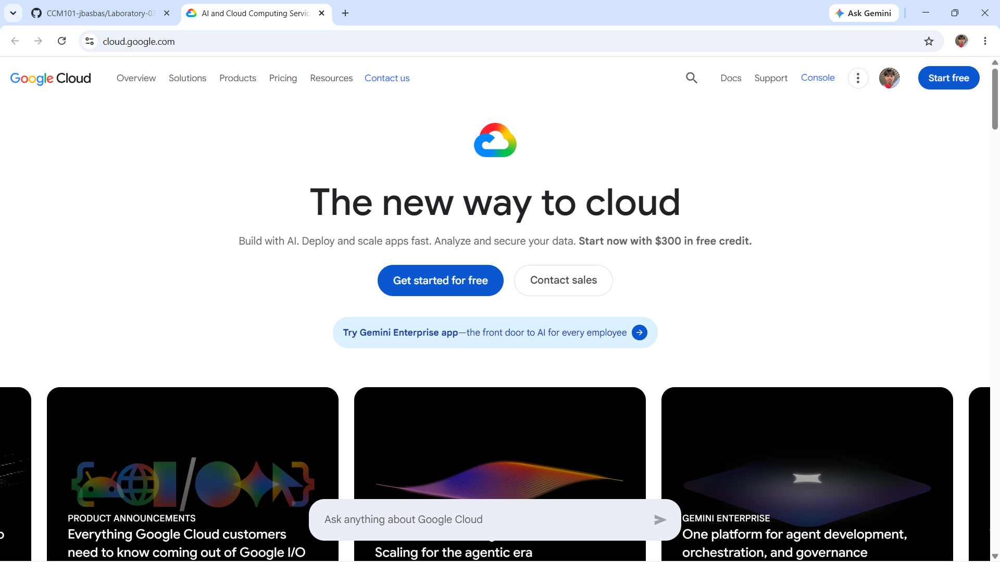

# Google Cloud Platform Research

## Brief Overview

Google Cloud Platform, or GCP, is Google's cloud computing platform. It provides services for computing, storage, networking, databases, Artificial Intelligence, Machine Learning, and container applications.

## Global Infrastructure

Google Cloud uses Regions and Zones in different locations around the world. These locations allow organizations to choose where their cloud resources will operate.

## Cloud Management Console

Google Cloud Console is the web-based interface used to create, manage, configure, and monitor Google Cloud resources.

## Four Core Services

### 1. Compute Engine

Compute Engine provides virtual machines that can be used to run applications and other workloads.

### 2. Cloud Storage

Cloud Storage is used to store files and other objects in the cloud.

### 3. VPC

Google Cloud VPC provides networking for cloud resources.

### 4. Cloud IAM

Cloud IAM manages identities, roles, and permissions for Google Cloud resources.

## Three Advantages

1. Google Cloud has strong Artificial Intelligence and Machine Learning services.
2. It has strong support for Kubernetes and container workloads.
3. It uses Google's global network infrastructure.

## Typical Enterprise Use Cases

Google Cloud can be used for AI projects, Machine Learning, data analytics, web applications, Kubernetes workloads, and cloud storage.

## Screenshot

Google Cloud screenshot:

