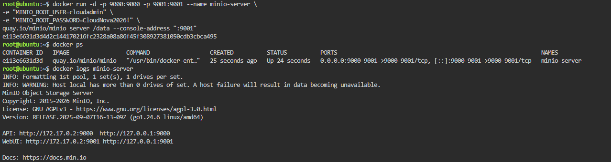
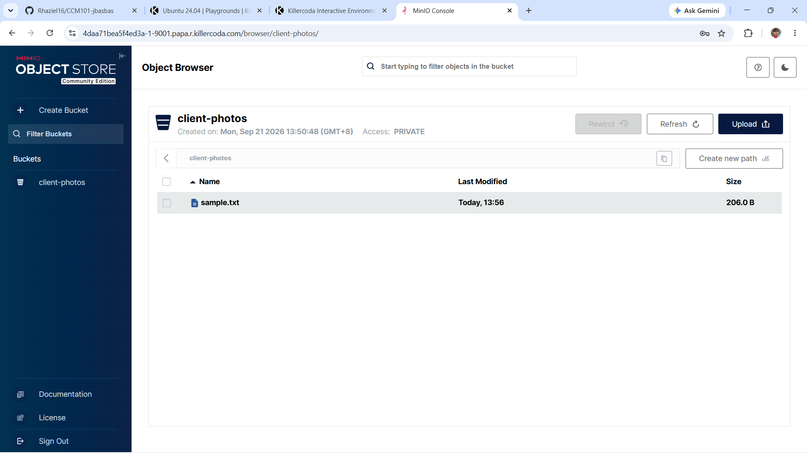

# Laboratory 05 - The Cloud Data Engineer

## Mission Overview

For this activity, I learned how object storage works and how to deploy MinIO using Docker. I used KillerCoda with Ubuntu to run the MinIO server. After that, I opened the MinIO web console, created a bucket, and uploaded a sample text file.

## Objectives

- Learn the difference between Block, File, and Object Storage
- Deploy MinIO using Docker
- Access the MinIO web console
- Create an object storage bucket
- Upload a sample file
- Document the steps and results in GitHub

## Tools Used

- GitHub
- KillerCoda
- Ubuntu 24.04
- Docker
- MinIO

## Skills Learned

- Using basic Docker commands
- Running a container in Linux
- Checking a running container
- Using a web-based object storage system
- Creating a bucket and uploading a file
- Writing Markdown documentation

## Files in this Laboratory

- [Storage Types Research](storage-types-research.md)
- [MinIO Deployment](minio-deployment.md)
- [Reflection](reflection.md)

## Screenshots

### MinIO Deployment

### Bucket and Uploaded File

## Problems I Encountered

At first, I tried to download the MinIO image using:

    docker pull minio/minio

However, the command returned a pull access denied error in KillerCoda.

I then tried the MinIO image from Quay:

    docker pull quay.io/minio/minio

This worked successfully, so I used the Quay image for the deployment.

I also accidentally typed `9001` directly in the terminal. The terminal returned `9001: command not found`. I learned that port 9001 should be opened through the KillerCoda port access option, not entered as a Linux command.

## Result

The MinIO server was successfully deployed and accessed through the web console. I created the `client-photos` bucket and uploaded `sample.txt` successfully.
